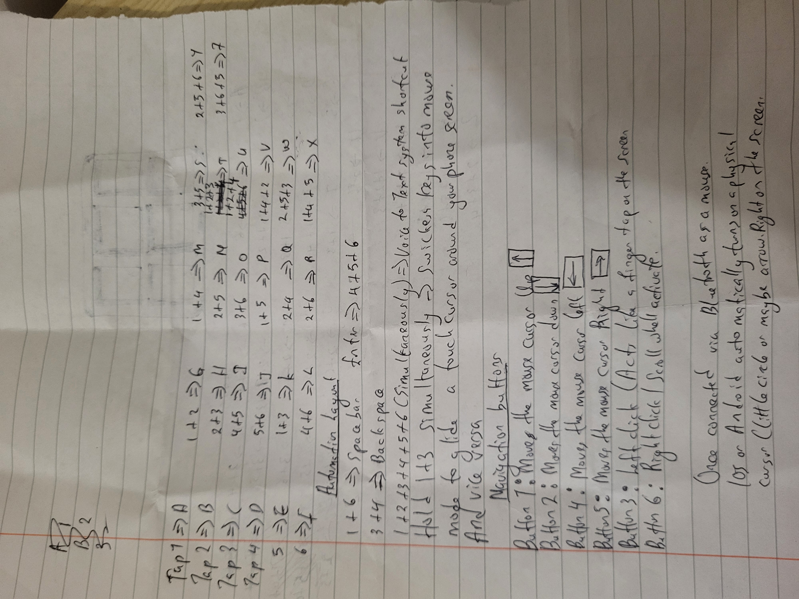

# CyberPocket 6-Button Keypad

An ultra-portable, wireless 6-button chorded keypad and touch-navigation controller designed for mobile devices. Built as a hardware engineering project for Hack Club Half-Life.

## Project Layout & Chord Design Master Plan

## How It Works
The device features a compact 3x2 grid of mechanical keys. It uses a custom chorded firmware layout so that users can tap specific combinations of buttons simultaneously to output all 26 letters of the English alphabet, system commands, and spacebar actions without a bulky physical layout.

# 6-Button Mobile Chording Macropad

# 6-Key Mobile Chording Macropad

Making a wireless 6-button macropad for my phone that lets me type full text and move the cursor using multi-button chords. Trying to keep the whole physical build under £30.

## Progress Log

### Hour 1: Planning & Design
- Sketched out the chord combinations on paper.
- Mapped single taps (A to F), 2-key chords (G to S), 3-key combinations (T to Z), and navigation keys.
- Set up the GitHub repo and initialized tracking.

### Hour 2: Firmware & Testing
- Wrote the main C++ firmware logic to handle button debouncing and simultaneous chord presses.
- Built-in mode toggling (holding 1+3 switches between typing text and controlling an on-screen mouse cursor).
- Created a test setup in Wokwi with 6 push buttons to test the code logic in the serial monitor before soldering anything.
